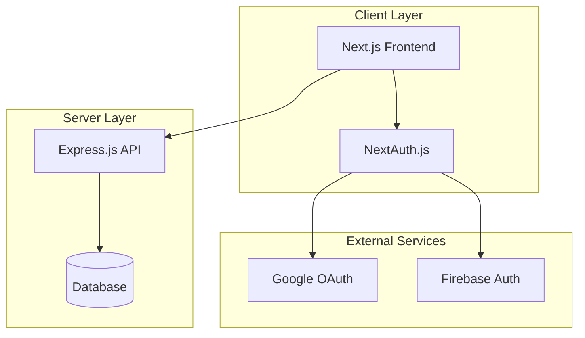
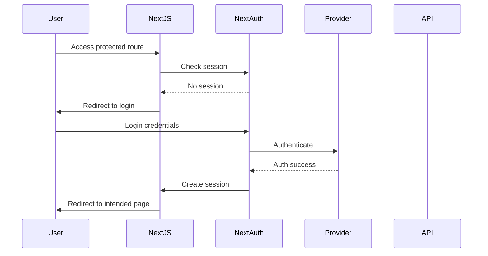

# Design Document

## Overview

This design outlines the architecture for a comprehensive Next.js e-commerce application built with Next.js 15/16 App Router. The system provides a modern, responsive web application with public product browsing capabilities and authenticated user features for product management. The application integrates with an external Express.js API for data persistence and uses NextAuth.js for authentication with both credential and OAuth support.

The application follows a client-server architecture where the Next.js frontend communicates with an Express.js backend API for product data management, while authentication is handled through NextAuth.js with session-based state management.

## Architecture

### High-Level Architecture



### Application Structure

The application follows Next.js 15/16 App Router conventions with a clear separation of concerns:

- **App Router**: File-based routing with layout hierarchy
- **Server Components**: Default for static content and data fetching
- **Client Components**: Interactive UI elements and forms
- **API Integration**: Axios-based HTTP client for external API communication
- **Authentication**: NextAuth.js with multiple providers
- **Styling**: Tailwind CSS with DaisyUI components

### Route Structure

```
/                    - Landing page (public)
/login              - Authentication page (public)
/register           - User registration (public)
/products           - Product list (public)
/products/[id]      - Product details (public)
/add-product        - Add new product (protected)
/manage-products    - Product management (protected)
/update-product/[id] - Edit product (protected)
```

## Components and Interfaces

### Core Components

#### Landing Page Components
- **Hero**: Main banner with call-to-action
- **Categories**: Product category showcase
- **Deals**: Featured deals and promotions
- **NewProducts**: Recently added products
- **Testimonials**: Customer reviews and feedback
- **Navbar**: Navigation with authentication-aware links
- **Footer**: Site information and links

#### Authentication Components
- **LoginForm**: Credential-based login form
- **GoogleLoginBtn**: OAuth login integration
- **ProtectedRoute**: Higher-order component for route protection

#### Product Components
- **ProductCard**: Individual product display component
- **ProductList**: Grid layout for multiple products
- **ProductDetails**: Comprehensive product information display
- **ProductForm**: Form for adding/editing products
- **SearchFilter**: Search and category filtering interface

### Data Models

#### User Model
```typescript
interface User {
  id: string;
  email: string;
  name?: string;
  image?: string;
  provider: 'credentials' | 'google';
}
```

#### Product Model
```typescript
interface Product {
  _id: string;
  title: string;
  shortDesc: string;
  fullDesc: string;
  price: number;
  category: string;
  imageUrl: string;
  date: string;
  createBy: string;
}
```

#### Session Model
```typescript
interface Session {
  user: User;
  expires: string;
}
```

### API Interfaces

#### Product API Endpoints
- `GET /products` - Fetch all products
- `POST /products` - Create new product
- `GET /products/:id` - Fetch single product
- `PUT /products/:id` - Update product
- `DELETE /products/:id` - Delete product

#### Authentication Flow


## Correctness Properties

*A property is a characteristic or behavior that should hold true across all valid executions of a system-essentially, a formal statement about what the system should do. Properties serve as the bridge between human-readable specifications and machine-verifiable correctness guarantees.*

### Property 1: Authentication Session Management
*For any* valid user credentials, successful authentication should create a persistent session that can be verified on subsequent requests
**Validates: Requirements 2.3, 2.6**

### Property 2: Authentication Error Handling
*For any* invalid credentials, the authentication system should reject the login attempt and provide appropriate error feedback
**Validates: Requirements 2.4**

### Property 3: Post-Authentication Redirection
*For any* successful authentication, the system should redirect users to the intended destination or default product list page
**Validates: Requirements 2.5, 8.2**

### Property 4: Route Protection
*For any* protected route, unauthenticated users should be redirected to the login page while authenticated users should gain access
**Validates: Requirements 5.1, 5.2, 8.1**

### Property 5: Product Data Fetching
*For any* product list or details page request, the system should fetch and display current product data from the Express API
**Validates: Requirements 3.2, 6.1**

### Property 6: Product Field Display
*For any* product, the rendered display should include all required fields (name, description, price, image) in both list and detail views
**Validates: Requirements 3.3, 4.3, 4.4**

### Property 7: Product Search and Filtering
*For any* search term or category filter, the product list should display only products that match the specified criteria
**Validates: Requirements 3.4, 3.5**

### Property 8: Product Creation API Integration
*For any* valid product data, the add product form should successfully send the data to the Express API and provide user feedback
**Validates: Requirements 5.5, 6.2**

### Property 9: Form Validation
*For any* incomplete or invalid form submission, the system should prevent submission and display appropriate validation errors
**Validates: Requirements 5.6, 5.7**

### Property 10: API Error Handling
*For any* API request failure, the system should handle the error gracefully and provide meaningful feedback to the user
**Validates: Requirements 4.5, 6.3**

### Property 11: Public Route Accessibility
*For any* public route (landing page, product list, product details), unauthenticated users should be able to access the content
**Validates: Requirements 1.3, 3.1, 4.1**

### Property 12: User Interface Feedback
*For any* user action (login, product creation, navigation), the system should provide appropriate visual feedback through notifications or loading states
**Validates: Requirements 5.4, 7.3, 7.5**

## Error Handling

### Authentication Errors
- Invalid credentials: Display clear error messages without exposing system details
- Session expiration: Redirect to login with preservation of intended destination
- OAuth failures: Graceful fallback with alternative login options
- Network errors: Retry mechanisms with user feedback

### API Communication Errors
- Network timeouts: Retry logic with exponential backoff
- Server errors (5xx): User-friendly error messages with retry options
- Client errors (4xx): Specific validation feedback
- Rate limiting: Queue requests with user notification

### Form Validation Errors
- Required field validation: Real-time feedback with clear messaging
- Data type validation: Format-specific error messages
- File upload errors: Size and type validation with helpful guidance
- Network submission errors: Preserve form data with retry options

### Route and Navigation Errors
- 404 errors: Custom error pages with navigation options
- Protected route access: Seamless redirect to login with return path
- Browser navigation: Proper handling of back/forward buttons
- Deep linking: Maintain application state for bookmarked URLs

## Testing Strategy

### Dual Testing Approach

The application will use both unit testing and property-based testing to ensure comprehensive coverage:

**Unit Tests** focus on:
- Specific component rendering scenarios
- Individual form validation cases
- API integration examples
- Authentication flow examples
- Error boundary behaviors

**Property Tests** focus on:
- Universal authentication behaviors across all credential types
- Product display consistency across all product data
- Form validation across all possible input combinations
- API communication patterns across all endpoints
- Route protection across all protected routes

### Property-Based Testing Configuration

- **Testing Library**: Fast-check for JavaScript/TypeScript property-based testing
- **Test Iterations**: Minimum 100 iterations per property test
- **Test Tagging**: Each property test references its design document property
- **Tag Format**: `Feature: nextjs-ecommerce, Property {number}: {property_text}`

### Testing Implementation Strategy

**Component Testing**:
- React Testing Library for component behavior
- Mock API responses for consistent testing
- Authentication state mocking for protected components
- Responsive design testing across viewport sizes

**Integration Testing**:
- End-to-end user flows with Playwright
- API integration testing with real endpoints
- Authentication flow testing with test accounts
- Cross-browser compatibility testing

**Performance Testing**:
- Core Web Vitals monitoring
- API response time validation
- Image loading optimization testing
- Bundle size analysis and optimization

The testing strategy ensures that both specific examples (unit tests) and universal behaviors (property tests) are validated, providing comprehensive coverage while maintaining development velocity.